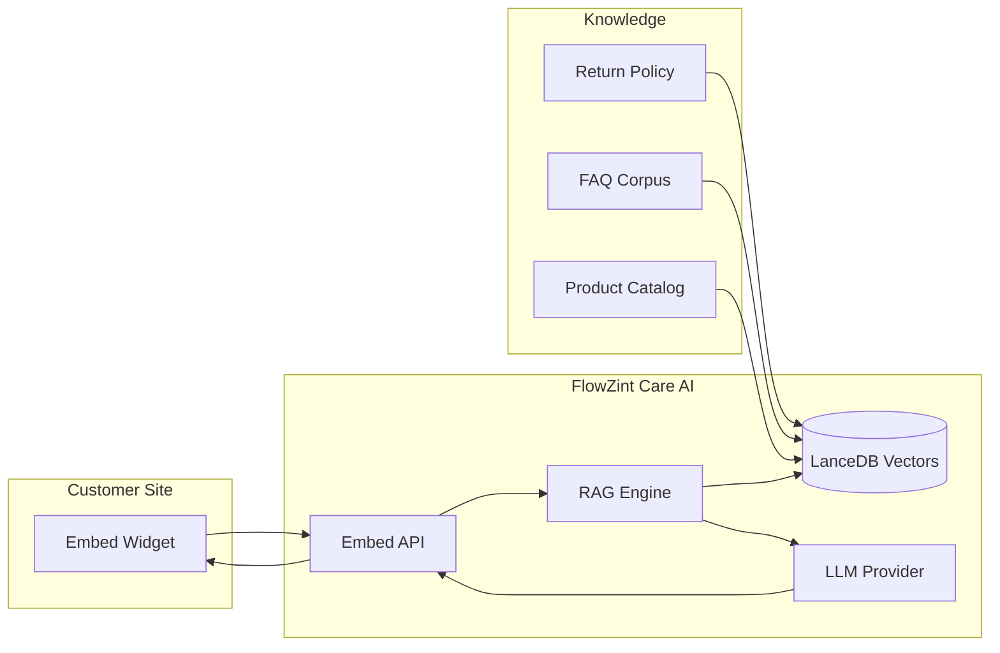
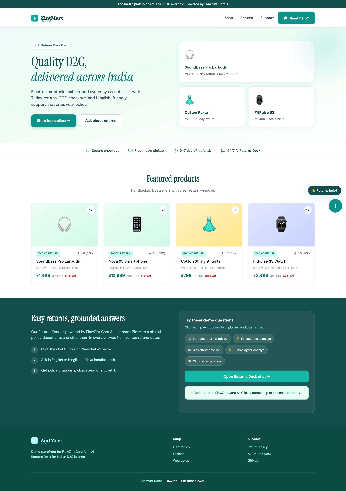
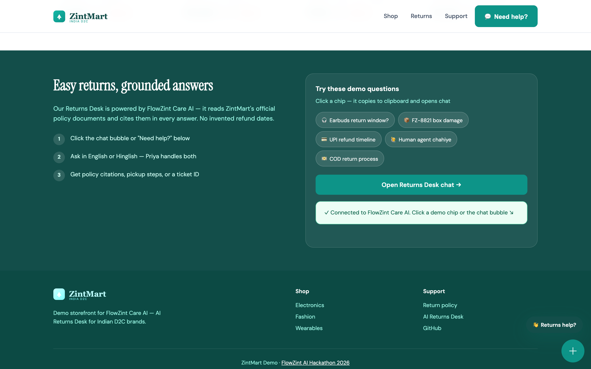

# FlowZint Care AI

**AI Returns Desk for Indian D2C brands** — embeddable support that answers from your policy documents, handles Hinglish conversations, and escalates to human agents with ticket IDs.

Built for the [FlowZint AI Hackathon 2026](https://flowzint.in/2026/ai/hackothon/) · Support Chat Bot track.

---

## Problem

Indian D2C brands lose customers on slow, inconsistent returns support. Shoppers ask the same questions in Hinglish — *refund kab aayega?*, *box damage tha*, *COD return kaise?* — while support teams re-type answers from PDF policies. Generic chatbots invent refund dates and cannot cite your rules.

## Solution

FlowZint Care AI is a document-grounded returns desk you embed in two lines of HTML:

- Upload return policy, FAQ, product catalog, and escalation playbook
- Customers chat on your storefront (demo: **ZintMart**)
- Answers cite policy excerpts; the Priya persona handles Hinglish with empathy
- Escalation emits `FZ-TKT-####` tickets with SLA messaging

**Novelty:** Vertical RAG tuned for Indian returns (COD, metro pickup, Hinglish), not a generic FAQ bot.

---

## Architecture



1. **Ingestion:** Markdown/PDF → chunk → embed → LanceDB  
2. **Retrieval:** Top-K similarity scoped to Returns Desk workspace  
3. **Generation:** System prompt + citations + escalation rules  

Details: [docs/ARCHITECTURE.md](docs/ARCHITECTURE.md) · Real-world use cases: [docs/IMPACT.md](docs/IMPACT.md)

---

## Quickstart

### Prerequisites

- **Docker Desktop** ([install guide](https://docs.docker.com/desktop/setup/install/mac-install/))
- **OpenAI API key** ([get one here](https://platform.openai.com/api-keys))

### Run in 5 minutes

```bash
git clone https://github.com/Akasxh/flowzint-care-ai.git && cd flowzint-care-ai
cp .env.example .env          # add OPENAI_API_KEY=sk-...
chmod +x scripts/*.sh
export OPENAI_API_KEY='sk-your-key-here'
./scripts/start.sh            # builds local image, serves :3001
./scripts/apply-appearance-db.sh
./scripts/setup-workspace.sh  # Returns Desk workspace + embed UUID
./scripts/demo.sh             # open ZintMart storefront + demo script
```

Open **http://localhost:3001** for admin · [`demo/storefront/index.html`](demo/storefront/index.html) for the customer view.

Smoke check: `./scripts/validate.sh`

> No Docker? See [docs/DOCKER_FALLBACK.md](docs/DOCKER_FALLBACK.md).

### Manual workspace setup

1. **New workspace** → name: **Returns Desk**
2. **Upload documents** from `corpus/`:
   | File | Purpose |
   |------|---------|
   | `return-policy-zintmart.md` | Return windows, refunds, COD |
   | `faq-hinglish.md` | Hinglish/English Q&A |
   | `product-catalog-snippet.md` | SKU warranty snippets |
   | `escalation-playbook.md` | SLA + `FZ-TKT-####` tickets |
3. **System prompt:** paste [`corpus/system-prompt-returns-desk.txt`](corpus/system-prompt-returns-desk.txt)
4. **Settings:** Temperature **0.2** · Chat with documents enabled
5. Copy embed snippet from [`demo/embed-snippet.html`](demo/embed-snippet.html)

Walkthrough: [docs/DEMO_GUIDE.md](docs/DEMO_GUIDE.md) · Query script: [docs/DEMO_SCRIPT.md](docs/DEMO_SCRIPT.md)

---

## Demo (90 seconds)

| Step | Action |
|------|--------|
| 1 | Scroll ZintMart homepage → open chat |
| 2 | *What is the return window for wireless earbuds?* → show citation |
| 3 | *Order FZ-8821 ka box damage tha* → empathy + pickup steps |
| 4 | *Mujhe human agent chahiye* → ticket `FZ-TKT-####` + SLA |
| 5 | Admin workspace + architecture diagram |

| Preview | |
|---------|---|
| Storefront |  |
| Chat + citation |  |

**Demo video:** Record using [docs/VIDEO_TODO.md](docs/VIDEO_TODO.md) and add your YouTube link before hackathon submit.  
**Submit pack:** [SUBMISSION.md](SUBMISSION.md)

---

## Repository layout

```
corpus/           # ZintMart knowledge base
scripts/          # start, setup-workspace, demo, validate
config/           # Appearance defaults + embed config
demo/storefront/  # ZintMart D2C demo site
docs/             # Architecture, impact, demo guides
frontend/public/  # FlowZint Care logo
```

---

## Impact summary

- **Ticket deflection:** Policy FAQs answered 24/7 with citations
- **Trust:** Grounded answers — no invented refund dates
- **India-ready:** Hinglish, COD returns, metro pickup vs self-ship
- **Drop-in deploy:** Embed script on Shopify, React, or static HTML

Full breakdown: [docs/IMPACT.md](docs/IMPACT.md)

---

## License

MIT — see [LICENSE](LICENSE). Third-party notices: [NOTICE](NOTICE).
